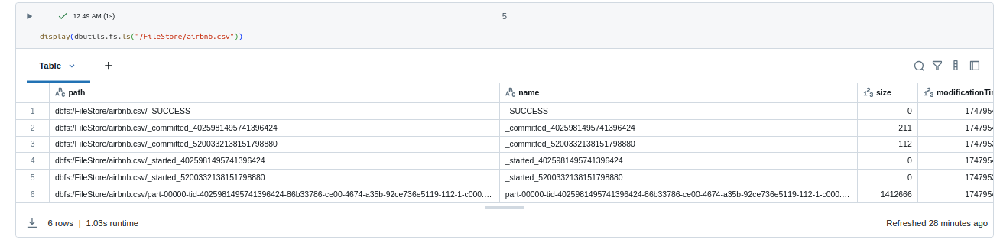

# Tutoriales para interactuar con el fichero airbnb.csv

## OPCIÓN 1: Cargar un fichero a ADLS y leerlo desde Databricks

Este tutorial te enseñará cómo:

1. Subir un archivo a **Azure Data Lake Storage Gen2 (ADLS)**
2. Configurar el acceso en Databricks
3. Leer el archivo en un notebook

## Requisitos previos

- Una cuenta de Azure activa.
- Acceso a un **Storage Account con ADLS Gen2 habilitado**.
- Permisos para subir archivos y configurar roles.
- Workspace de Databricks conectado al mismo tenant de Azure.


## 1. Subir el fichero a ADLS Gen2

### Paso 1: Ir al recurso del Storage Account

1. Ve al portal de Azure: [https://portal.azure.com](https://portal.azure.com)
2. Busca tu **Storage Account**
3. Accede a la opción **Contenedores** (Containers)

### Paso 2: Crear un contenedor (si no existe)

1. Pulsa **+ Contenedor**
2. Asigna un nombre (por ejemplo: `datasets`)
3. Selecciona el nivel de acceso: `Privado`

### Paso 3: Subir el archivo

1. Entra al contenedor creado
2. Pulsa en **Cargar** (Upload)
3. Selecciona el archivo desde tu ordenador (por ejemplo: `airbnb.csv`)
4. Espera a que se cargue correctamente


## 2. Configurar el acceso desde Databricks

### Opción recomendada: Acceso mediante Azure Identity (ABFSS)

En Databricks, usarás el **formato ABFS(S)**. Asegúrate de tener:

- Un **mount point o acceso directo vía ABFS**
- Permisos en el Storage Account: asigna el rol `Storage Blob Data Reader` a tu cuenta o a la **Managed Identity** del cluster (si usas Unity Catalog)

### Sintaxis general del path ABFS

```text
abfss://<container>@<storage-account-name>.dfs.core.windows.net/<path>
```

Por ejemplo: 
```text
abfss://datasets@midatalake.dfs.core.windows.net/airbnb/airbnb.csv
```

```python
df = spark.read \
    .format("csv") \
    .option("header", "true") \
    .load("abfss://datasets@midatalake.dfs.core.windows.net/airbnb/airbnb.csv")

display(df)
df.printSchema()
```

NOTAS: 
- Asegúrate de que el cluster tiene acceso a Azure AD (mediante scope o identidad administrada).
- Si tienes problemas, revisa el error exacto y asegúrate de que los permisos están correctamente asignados.

## OPCIÓN 2: Subir el fichero manualmente a DBFS y crea una tabla con el Notebook DBFS_Example.py

### Paso 1: Subir el Fichero

Desde el Workspace: Data Ingestion > Legacy products > Upload files to DBFS > Files

### Paso 2: Subir el Notebook  

Desde el Workspace: File > Import > File > browse (y elige el fichero)

### Paso 3: Ejecuta el Notebook para crear una tabla

```python
df.write.format("parquet").saveAsTable(permanent_table_name)
```
La tabla se encontrará en Legacy > hive_metastore.default.airbnb


### Extra: Descargar un fichero guardado en Databricks


```pyhon
airbnb_df.coalesce(1).write.mode("overwrite").option("header", True).csv("/FileStore/airbnb.csv")

display(dbutils.fs.ls("/FileStore/airbnb.csv"))
```




Para descargar el fichero, incluye el nombre completo del csv en el navegador del siguiente modo: 
```text
https://adb-{tu-workspace}.azuredatabricks.net/files/airbnb.csv/part-00000-tid-4025981495741396424-86b33786-ce00-4674-a35b-92ce736e5119-112-1-c000.csv
```
Debes estar logeado. 